# Stock Trading Android App

This full-stack application simulates live equity trading in a cloud environment. Built with Kotlin on the frontend and Google Cloud, NodeJS on the backend with MongoDB as the primary database, the app is hosted on Google Cloud Platform.

## Features
- A custom **Splash Screen** with an app icon.
- **Finnhub Stock APIs**: Fetch data for stock tickers, including price quotes, charts, and news.
- **Autocomplete**: The search bar utilized an autocomplete functionality whenever some characters were entered.
- **Home Section**: Displays the user's current net worth and remaining balance. Divided into portfolio and favorites sections.
- **Stock Trading**: Buy and sell shares, with transaction results stored in MongoDB.
- **Portfolio Section**: Displays the user’s current portfolio.
- **Favorites Section**: Allows users to shortlist stocks to monitor.
- **Swipe and Delete** as well as **Drag and Reorder** functionalities have been implemented.

  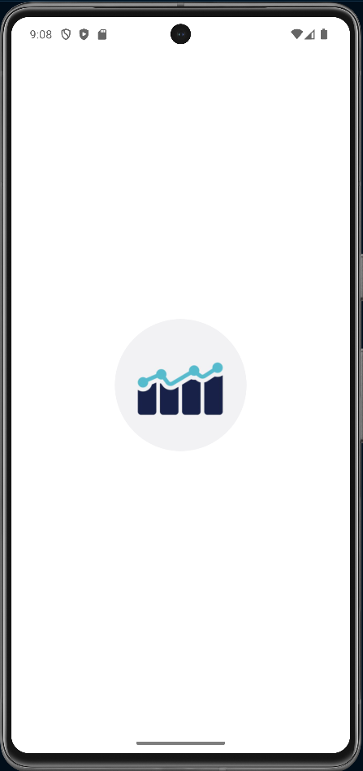
  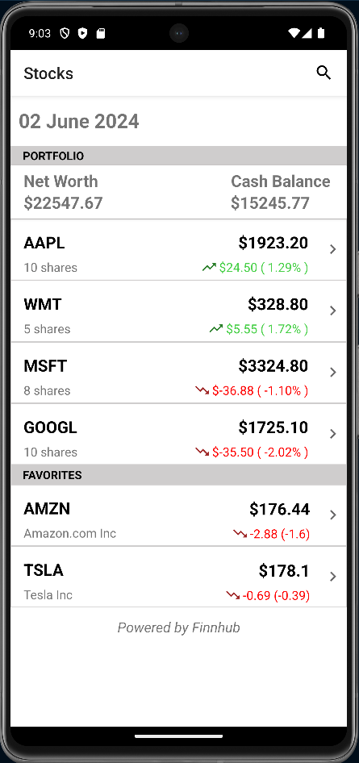
  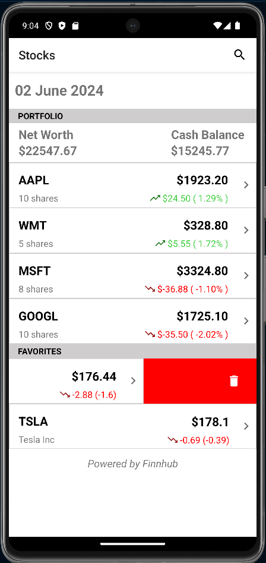
  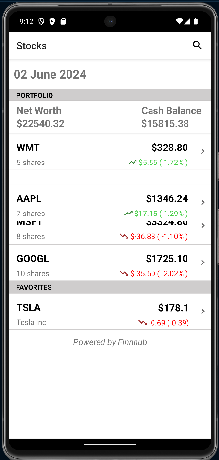
  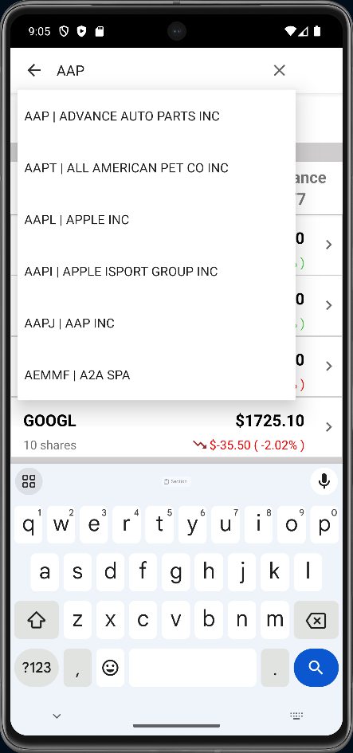
  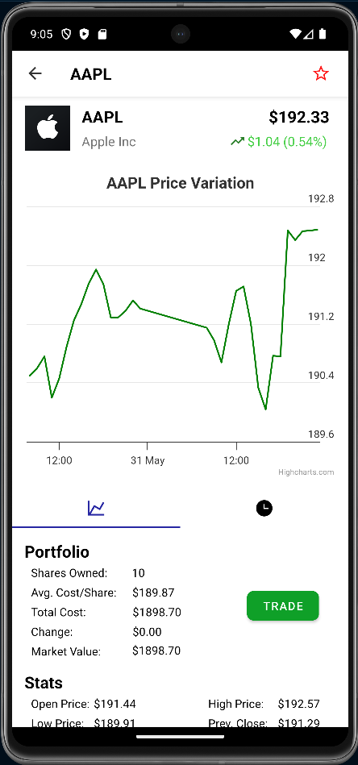
  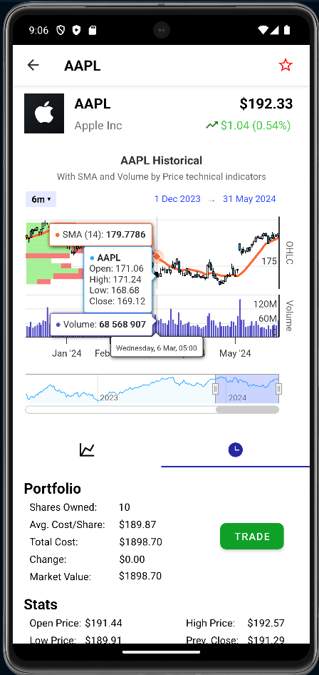
  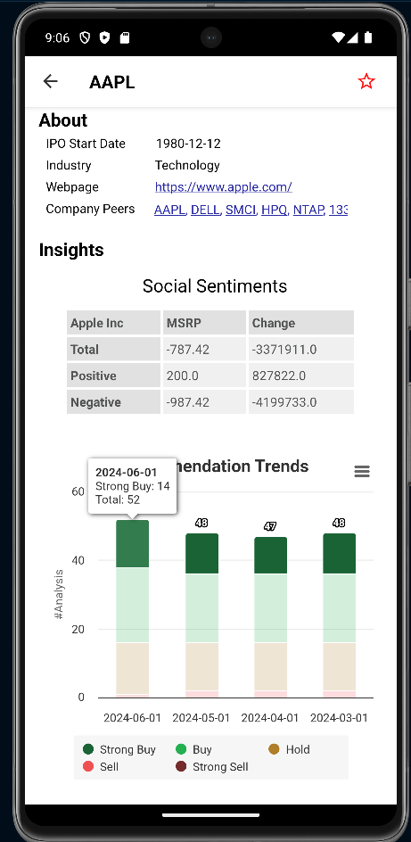
  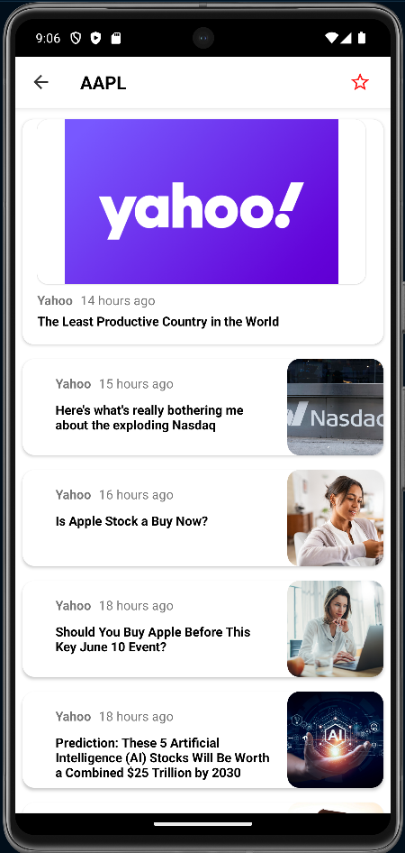
  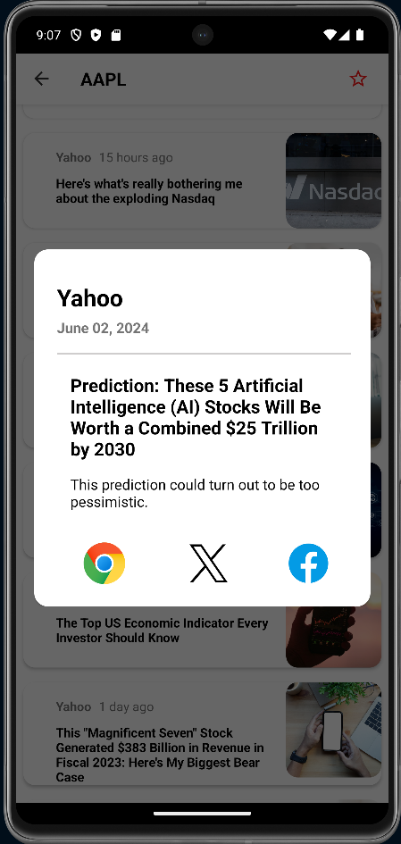
  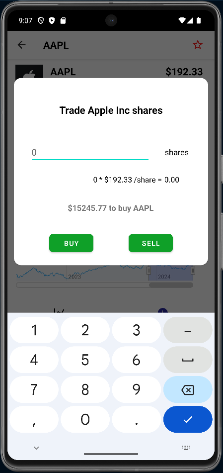
  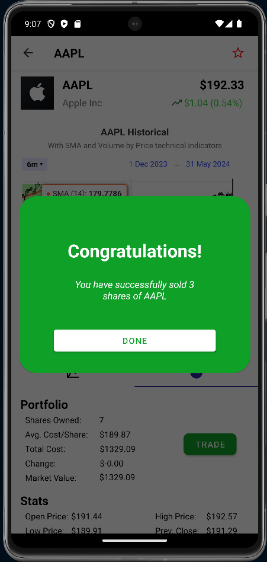

